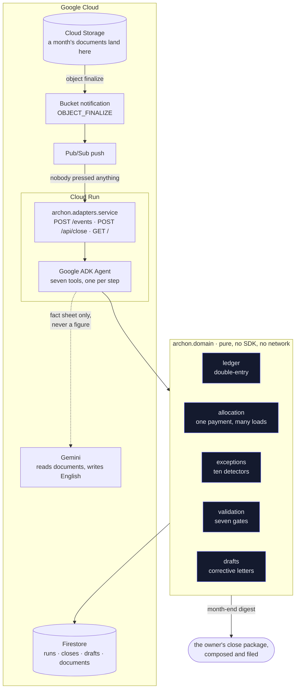

# Archon

[](https://github.com/upgradedev/archon-gcp-agentic/actions/workflows/ci.yml)
[](https://github.com/upgradedev/archon-gcp-agentic/actions/workflows/readiness.yml)
[](LICENSE)

*The readiness badge is a submission gate, not a build gate: it fetches the
live judge URL below and refuses to pass while that URL is a placeholder or
down. It was red for most of this build, on purpose, and it is green now
because the URL is real and answering. The CI badge covers the secret scan, the
build, the tests and the browser journey.*

> **Archon is a bookkeeping agent for owner-operator trucking firms that splits one broker payment back across the eight loads it settles and files the letters chasing what was underpaid, so the owner opens a closed month with the letters already written instead of a shoebox they will get to in April.**

Built for [All Things Agentic](https://allthingsagentichackathon.devpost.com/), track **The Taskmaster**.

- **Live demo**: [https://archon-70489367760.us-central1.run.app/](https://archon-70489367760.us-central1.run.app/). No account, no install, one button.
- **Demo video**: recorded by CI against the deployed release, gated on the
  live service reporting that exact release and the `adk-agent` close path
  before a frame was taken, and bound to the green CI and Security runs for
  the same commit. It is a build artifact -- 1080p, seven scenes, sha256 in a
  receipt checked against the file -- and has **no public URL yet**; the
  submission link is the owner's to add.
- **Who it is for**: owner-operator trucking firms running three to twelve trucks.

---

## Contents

- [The submission description](#the-submission-description)
- [The chore](#the-chore)
- [Why a haulier's month is hard](#why-a-hauliers-month-is-hard)
- [Spin it up](#spin-it-up)
- [What one run does](#what-one-run-does)
- [Architecture](#architecture)
- [Architecture review, and the gaps left in it](#architecture-review-and-the-gaps-left-in-it)
- [Where the autonomy stops, and why there](#where-the-autonomy-stops-and-why-there)
- [What Google is doing here](#what-google-is-doing-here)
- [The books are computed, never phrased](#the-books-are-computed-never-phrased)
- [Tests and evidence](#tests-and-evidence)
- [Who owes whom, and which way it is going](#who-owes-whom-and-which-way-it-is-going)
- [The trigger, fired on the live deployment](#the-trigger-fired-on-the-live-deployment)
- [Deploy it](#deploy-it)
- [Pre-existing components](#pre-existing-components)
- [Honest scope](#honest-scope)
- [Licence](#licence)

---

## The submission description

*This is the text for the entry form, kept here so it is reviewable and so it
cannot drift from the product. Owner's voice, no em dashes.*

---

Archon closes a small trucking firm's month while nobody is watching, and the
thing that makes that possible is that it can split one broker payment back
across the eight separate loads it settles.

That sounds small. It is the reason a haulier's books never close. A broker does
not pay per load. It pays once a fortnight, in a single bank credit, covering
however many loads it feels like, minus a factoring fee charged on the whole
batch, minus whatever it decided to hold back on individual loads. The bank shows
one number, and the payment must be allocated across the eight loads it
settles, with the batch fee accounted for separately. Matching software
cannot do it, because
matching asks "which document is this payment" and the honest answer is "eight of
them, at amounts none of which equal the payment."

So Archon allocates instead, and then proves its own answer. What landed in the
bank has to equal what the lines pay, less the fee charged once. When that leaves
anything over, it says so rather than pushing it into a suspense account.

A month of documents lands in a Cloud Storage bucket, and then one empty object
called `_READY` says the batch is complete. Nothing is pressed. The bucket's own
finalize notification publishes to a Pub/Sub topic, whose push subscription wakes
a Cloud Run container with an OIDC token; each document is acknowledged and held,
and the marker starts the close. That marker is there because Cloud Storage never
says "that was the last one", and without it a folder of 27 documents would close
the month 27 times, 26 of them over a month that had not finished arriving. The
close then works through eleven steps: it classifies 27 artifacts, posts the double-entry journal,
splits the remittance, reconciles which loads were paid, finds the ten things
that do not add up, writes
the corrective letters, checks its own books against seven gates, and marks the
period closed with a trail in Firestore you can walk back through.

Then it writes the owner their month-end letter and hands it to a delivery
seam, with a receipt that says what actually happened: delivered when a mail
channel is configured, composed and filed when none is, and the demo runs with
none so that no credential sits in a public repository. The letter matters more
than it looks. A haulier does not open a bookkeeping console on the first of
the month, because a haulier is driving. The letter is the month in the shape
they would read it: what the firm made, what is at stake and of what kind, and
what Archon already did about it.

**What the buyer gets, said precisely.** Archon does not win work or raise
rates. It gives back the hours a month-end takes, catches the money that leaks
when nobody has those hours, and turns "I think we are fine" into figures with
sources attached. On the bundled synthetic month that is 612.85 of quiet
leakage caught and a close that runs unattended instead of eating an evening;
both figures are labelled, measured, and reproducible by pressing the button.
Being precise about which value is which is the difference between a tool and
a pitch.

On the July it ships with: 23,005.00 billed over 10,810 miles against 20,598.16
spent, a margin of 0.223 a mile. The letters it writes break into three
different things, and they are reported separately because adding them up
produces a number that flatters us. How MANY there are is not fixed: an
agent decides which exceptions warrant a letter and which go to the owner
instead, so the count moves between runs and a number printed here would be
true of one of them:

| | | |
|---|---|---|
| **612.85** | leaking away quietly | a broker that paid 200.00 light on one load without saying so, and a truck stop that charged the same 412.85 twice in three days. **This is the only figure the agent can be said to have found.** Nobody was going to notice either one |
| 4,900.00 | invoiced and unpaid | two loads no remittance has touched. Owed already. An invoice ledger shows this without any agent, so chasing it is useful work and not a discovery |
| 1,865.00 | spent with no paperwork | money already gone, with no invoice behind it. Recovers nothing at all. It is a tax-deductibility and completeness problem |

An earlier version of this README added those to 5,512.85 and called the total
recoverable. That was a nine-fold overstatement and it is recorded here rather
than quietly corrected.

The letters to brokers and suppliers are written, costed and filed unsent. That is
the one thing a person does, and it is deliberate: every step Archon takes can be
re-run and produces the same books, but an email to a broker cannot be un-sent.

You can work that gate on the demo. Approve or reject any letter and the state
moves, with an audit line carrying the timestamp and what happens next. It is a
public sandbox and it says so: nothing is sent, the decision is not kept, and the
approver reads "sandbox visitor" where a configured deployment records a person.
There is deliberately no server endpoint behind it, because one nobody can
authenticate to is dead code and a fake identity in an audit trail is a worse lie
than a missing button.

Every figure above was computed by a deterministic ledger, never phrased by a
model. Gemini's role is judgement and sequencing, not arithmetic: the ADK agent
decides which tool to call and when the month is finished, weighs what each
exception deserves and can withhold a close the gates passed; when the live
narrator is enabled it also phrases the summary from a fact sheet it cannot add
to. Parsing and every figure are deterministic, and a gate fails the whole close
if an unreadable document is ever given a figure, because that is the one
failure that would not announce itself. An artifact nobody could read is
reported as an exception and posted as nothing.

Built on Google ADK, Gemini 3.7 Flash, Cloud Run, Firestore, Cloud Storage and Pub/Sub. Take
ADK away and the judgement goes with it: the trigger would still fire arithmetic,
but nothing would weigh the exceptions, choose what each deserves, or withhold a
close the gates passed. Take Firestore away and a container that scales to zero
between months has nowhere to keep the trail.

It is for owner-operator trucking firms running three to twelve trucks. It replaces
the shoebox, and the bookkeeper who gets to it in April.

---

## Who buys this, and what it replaces

**The buyer, named: the owner of a trucking firm running 3 to 12 trucks.** Not
"small businesses". That owner signs the bookkeeper's invoice today, which is
what makes them the payer and not merely the user.

- **Why this segment**: the many-to-one payment problem is their daily shape.
  One broker remittance settles many loads, minus a batch fee, minus per-load
  holdbacks. A one-truck operator does not have enough loads for the problem to
  bite; above about twelve, a firm hires someone whose job this is.
- **What it replaces**: the shoebox, the spreadsheet, and the April
  reconciliation where a year of quiet short-pays surfaces at once.

### It reads an invoice now, and refuses the documents that only look like one

Asked whether a non-haulage business could drop its own files in, the honest
answer was no, and the close said nothing: two consulting invoices came back
unrecognised, posted nothing, and the month closed at zero revenue reporting
every gate passed. Both halves are fixed. G6 blocks a month with an
unrecognised document in it, and `SALES_INVOICE` and `PURCHASE_INVOICE` are now
real families with real postings: Dr Receivable, Cr Revenue, Cr VAT payable,
and its mirror.

The parser reads `5,890.00` and `5.890,00` through one function rather than
two, because two locale parsers sharing call sites is how the same string
becomes two different amounts. Field spellings go through an alias table where
a **disagreement returns nothing**: an invoice stating `Total Due 7,303.60` and
`Grand Total 9,999.99` leaves the total empty rather than picking whichever the
table listed first, and the derivation that would otherwise fill it back in is
blocked across a contradiction.

What it refuses is as deliberate as what it reads. A credit note, a proforma, a
quotation, a purchase order and a statement of account all carry an invoice's
vocabulary, and every detector in this product is sign-naive, so a credit note
booked as a purchase invoice would overstate the expense and then hide from
every check that would have caught it. They are recognised precisely well
enough to be refused. So is `03/04/2026`: two real readings thirty days apart,
which is a period boundary and an ageing bucket, so the document carries no
date rather than a coin flip. And prose that merely mentions an invoice is
evidence, never a candidate: a cover note reading "please find the invoice
attached" stays unrecognised instead of becoming an invoice for the sentence.

**The haulage corpus is untouched, structurally.** Every bundled artifact
carries a `Document Type:` line and is decided by the declared-label lookup,
which none of the invoice machinery can reach, and a test asserts that so the
guarantee cannot rot as the keyword table grows.

### The arithmetic, so it is not a sentence

| | | |
|---|---|---|
| **How many** | Filter the FMCSA Motor Carrier Census on `NBR_POWER_UNIT` between 3 and 12 | The census is public and downloadable from the [DOT open data portal](https://catalog.data.gov/dataset/motor-carrier-registrations-census-files); a reviewer opens it and counts rather than taking our word. The published distribution has **91.5% of carriers operating ten or fewer trucks** and about **1.16 million single-truck operators**, so the 3-to-12 band is what remains of the small-carrier mass after the one and two truck operators, and it is in the hundreds of thousands |
| **What one pays today** | **400 to 500 dollars a month** for outsourced bookkeeping at this fleet size | [Remote Books Online, trucking and transportation](https://www.remotebooksonline.com/blog/what-is-the-average-cost-of-bookkeeping-services-for-trucking-transportation): solo operators pay 150 to 250, and "larger fleets or multi-state operations may see costs upward of 400-500/month". Call it **6,000 dollars a year** at the top of that band |
| **The row** | **1,667 customers x 6,000 dollars = 10.0 million dollars** | The count needed is a low four-figure number against a segment in the hundreds of thousands, so the row closes on well under one percent of the register |

The number that would sink this is the price, not the count, and it is anchored
to what these firms already spend rather than to what we would like to charge.

**On breadth, stated once and then left alone.** The close engine's arithmetic
is not trucking: `allocate_all` divides one settlement across the obligations it
covers, less a fee charged once, and the residual identity is
`landed == lines - fee` with no haulage in it, asserted by
`test_the_allocation_arithmetic_is_not_about_trucking`. The engine's *names* are
trucking throughout, and so are `DocType`, the chart of accounts and every
`Statements` field that reaches the JSON. So the honest statement is: the
arithmetic generalises and is proven to; the vocabulary does not, and no second
pack ships in this entry. This paragraph is the whole claim, and it is below the
fold on purpose.

All money figures in this README are from the bundled synthetic month and are
labelled as such; no real firm's books appear anywhere in this repository.

## The chore

A month of mail lands in a bucket. Nobody is watching. Archon then:

1. takes in 27 artifacts and classifies each one
2. posts the double-entry journal
3. **splits one broker remittance across the eight loads it settles, net of the factoring fee**
4. reconciles which loads got paid and which did not, and builds the **open
   items register**: who owes the firm, who the firm owes, and how old each is
5. triages what is missing or contradictory, worst first
6. **decides what to do about each one**: chase it, put it in front of the owner,
   or note it. This is the agent's own judgement, and every choice is checked
   against the books before it can take effect
7. writes the corrective letters and files them
8. checks its own work against seven gates, one of which refuses to close a
   month while any document the owner sent went unrecognised
9. writes the month-end summary from a fact sheet it is not allowed to add to
10. marks the period closed with a trail you can walk back through
11. **writes the owner their month-end letter and hands it to the delivery
    seam**, recording delivered or filed on the receipt, because a haulier does
    not open a bookkeeping console on the first of the month, they are driving

Nobody is asked anything at any point. The one thing a person does is approve
the letters that would leave for a third party. On this deployment that
approval is a SANDBOX: the page records who decided and when, and nothing is
sent, because no delivery channel is configured in any file under `infra/` and
the deliverer the public routes are handed has no code path that sends. A
configured deployment is where the approval would actually release a letter.

**The trigger**: an object landing in the Cloud Storage bucket. The bucket
notifies a Pub/Sub topic, and its push subscription calls the service with an
OIDC token. Nobody presses anything.
**The surface**: the owner's own inbox, which they already open.
**What it replaces**: the shoebox, and the bookkeeper who reconciles it in April.

## Why a haulier's month is hard

A broker does not pay per load. It pays once a fortnight, in a single bank
credit, covering however many loads it feels like, minus a factoring fee charged
on the whole batch, minus whatever it decided to hold back on individual loads.

The bank shows one number. Eight loads and one batch fee have to come out of it.

Matching software cannot do this. Matching asks "which document is this
payment?" and the answer is "eight of them, at amounts none of which equal the
payment." Archon allocates instead, and then proves its own answer against an
identity that has to close:

```
what landed in the bank  ==  what the lines pay  -  the fee charged once
```

When that identity leaves a residual, the close raises it. It does not absorb it
into a suspense account, because a suspense account is where a bookkeeper hides
the thing they could not explain, and hiding it is exactly what the owner is
paying for this not to do.

## Spin it up

**The whole close, with nothing installed.** No key, no credential, no network,
no dependency beyond the Python standard library:

```bash
git clone https://github.com/upgradedev/archon-gcp-agentic.git
cd archon-gcp-agentic
python run.py
```

That prints the eleven-step trail, the month, the exceptions and the filed
letters. CI runs that exact command inside an empty virtualenv on every push, and the
readiness gate runs it too, so if it ever stops working the build goes red
rather than a judge finding out.

`run.py` is three lines: the package lives under `src/`, and asking a judge to
`pip install -e .` before seeing anything would make the claim above false.

**The page and the API:**

```bash
pip install -r requirements.txt
uvicorn archon.adapters.service:app --reload
```

Then open `http://localhost:8000`, press one button, and watch it run.

The console has ten sections behind the tab rail: what Archon does, watch the
agent, documents read, the allocation, open items, exceptions, letters, trends,
fleet and checks. A switcher offers every month with mail on file. The tiles are controls rather than ornaments,
because each one opens the ledger its number came out of.

**Let the ADK agent drive it** (needs a Gemini key):

```bash
export GOOGLE_API_KEY=...
python run.py --agent
```

**Run the tests:**

```bash
pip install -r requirements-dev.txt
python -m pytest
```

## What one run does

Over the bundled month, `python run.py`:

```
 + 1. Take in the month's mail
     27 artifacts: bank transaction x6, broker remittance x1, driver
     settlement x3, fuel card statement x1, insurance invoice x1, load
     confirmation x9, maintenance invoice x2, toll invoice x3, unreadable
     x1
 + 2. Post the double-entry journal
     25 entries posted from 27 artifacts, 2 deliberately left unposted
 + 3. Split each remittance across the loads it settles
     1 remittance(s) split across 8 loads; every one reconciles
 + 4. Reconcile loads against what the brokers paid
     8 of 9 loads settled, 2 still outstanding; 5,100.00 owed to the firm
     across 3 item(s), 3,564.75 owed by it across 5
 + 5. Find what is missing or does not add up
     10 exception(s), 3 of them errors, 2,477.85 at stake
 + 6. Decide what to do about each exception
     5 draft, 2 escalate, 3 note (standing policy)
 + 7. Write the corrective documents
     5 document(s) drafted and filed unsent: 612.85 that would have leaked
     away, 4,900.00 already owed and unpaid; 2 put in front of the owner
     instead
 + 8. Check the close against its own gates
     7/7 gates passed
 + 9. Write the month-end summary
     summary written from a 63-line fact sheet (deterministic); no figure
     was phrased by a model
 + 10. File the close and mark the period
     period 2026-07 marked closed (closed with an unreadable document
     escalated to the owner); books, 5 draft(s) and a 11-step trail
     persisted to memory
 + 11. Write the owner their month-end letter
     "2026-07 closed. 612.85 was quietly leaking, 5 letters ready" ->
     composed for owner@bellridgehaulage.example and filed; no channel is
     configured, so nothing left this machine
 = closed in 16 ms
```

**The live demo prints two of these lines differently, and that is the point.**
`python run.py` is the deterministic path: standing policy decides each
exception, and step 6 reads `5 draft, 2 escalate, 3 note` over a 63-line fact
sheet. The deployed service runs with `ARCHON_AGENT_CLOSE=1`, so the ADK agent
makes those dispositions itself, and it reads `5 draft, 3 escalate, 2 note`
over 66 lines -- it escalates one thing policy would only have noted. Same
month, same books, same 2,406.84, same seven gates: the agent's judgement moves
the DISPOSITIONS and cannot move the arithmetic. If the two blocks agreed
exactly, the agent would be decorative. You can see which one produced a given
payload without asking: `/api/close/2026-07` is stamped `driver`, and it says
`adk-agent` live and `deterministic` on the cold-start path.

The month it found: 23,005.00 billed over 10,810 miles, 20,598.16 spent,
2,406.84 of profit. That is 2.128 a mile earned against 1.905 a mile spent, and
the 0.223 a mile left over is why the 612.85 that was quietly leaking matters
at all. On a fatter margin it would be noise.

### The ten things it looks for

Every one has a deterministic detector, and every one fires on the bundled
month, asserted by a test:

| What | Example from the bundled month |
|---|---|
| Payment with no document | 1,865.00 left the account referencing INV-2291 with no invoice on file |
| Silent short pay | Load L-7105 invoiced at 2,460.00, remittance paid 2,260.00, no reason given |
| Duplicate charge | The same 412.85 fill at the same truck stop three days apart |
| Amount outlier | A 1,890.00 fill, 4.6x this firm's own median for that supplier |
| Tax inconsistency | An invoice at 20% when this firm's own prevailing rate is 8% |
| Unpaid load | Two loads run and invoiced that no remittance has touched |
| Unreconciled remittance | A remittance paying a load with no confirmation on file |
| Out of period | A June toll invoice arriving in July's mail |
| Unreadable document | A cab-phone scan with no text layer, left unposted rather than estimated |
| Unrecognised document | An artifact that read perfectly and matched no family, so nothing was posted from it. Blocks the month at G6 rather than drafting a letter: the remedy is a parser, not a dispute |

Every threshold is learned from the firm's own books. A charge is an outlier
because it is far above what **this** firm normally pays **that** supplier, not
because it crossed a figure somebody wrote down. That is what lets Archon work
on a firm's first month, before anyone has configured it.

## Architecture

Two diagrams. The first is what runs where. The second is the one that matters:
what the agent does between a file landing and the owner reading about it.



The agent flow, from a file landing to the owner reading about it, and where
the two outward edges sit:

```mermaid
sequenceDiagram
    autonumber
    participant B as Cloud Storage
    participant A as ADK Agent
    participant D as archon.domain
    participant F as Firestore
    participant O as Owner
    participant X as Broker

    B->>A: object finalize, period 2026-07
    A->>D: take_in_mail
    D-->>A: 27 artifacts classified
    A->>D: post_journal
    D-->>A: 25 entries balanced, 2 left unposted
    A->>D: allocate_remittances
    D-->>A: 8 loads settled, identity closes
    A->>D: triage_exceptions
    D-->>A: 10 exceptions, 3 errors
    A->>D: decide_actions
    D-->>A: draft / escalate / note, per exception
    A->>D: draft_corrections
    D-->>A: letters, status=filed
    A->>D: verify_and_file
    D-->>F: books, drafts, 11-step trail
    A->>O: month-end digest, composed and filed
    Note over A,X: the letters to brokers stop here.<br/>a human approves; no channel is configured.
    X--xA: nothing is sent unattended
```

The deterministic engine is standard library only. ADK, Firestore and FastAPI
sit on top of it and are imported lazily, which is why the close runs on a clean
checkout and why the whole test suite runs offline.

## Architecture review, and the gaps left in it

Three frameworks apply to this build. Each table's last column is the residual
gap, and it is never empty: a review with nothing left over is a review that was
not done.

### Google Cloud Architecture Framework, plus the agentic lens

| Pillar | What this build does | Residual gap |
|---|---|---|
| Operational excellence | Every run writes an eleven-step journal to Firestore with counts per step, so an unattended close can be retraced. `POST /api/close/{period}` re-runs it deterministically | No alerting and no SLO. Nobody is paged if a month fails to close |
| Security | The domain layer holds no credential and reaches no network. Secrets come from environment only, and the SMTP password never reaches a receipt or a stored document, asserted by a test. `POST /events` verifies an OIDC token for this service's own audience and answers 403 to anyone else | The page and `/api/close/{period}` are open to anyone, deliberately, so a judge needs no account. There is no tenancy: one company, one bucket, one set of books |
| Reliability | A model outage, a mail server outage or a deliverer raising cannot fail a close: each is caught and the deterministic path continues. Seven gates block a close that cannot verify its own books. An event claim carries a lease, so a container killed mid-close does not block its month until the message expires; take-over is a compare-and-set on the attempt counter, and after three failures the month is recorded `dead-letter` and the message acked | Single region. The dead letter is APPLICATION-level -- a status on the marker, a log line and a response body. There is no Pub/Sub dead-letter topic on the push subscription, no route that lists failures and no alert |
| Cost optimisation | Firestore and Cloud Run both cost nothing when idle, which is the shape of a business that closes its books twelve times a year | No budget alert configured |
| Performance efficiency | The close is 27 artifacts and finishes in about 15 ms locally, because the engine is pure Python over in-memory structures | Never load tested. A firm with 40 trucks and 400 fuel lines is untested |
| Sustainability | Scale to zero between months; no idle compute | Not measured |
| **Agentic lens: bounded autonomy** | Two edges with different rules. The agent acts freely on state it owns and stops at a third party's inbox. Enforced by there being no send path to a counterparty, asserted by two tests | The boundary is enforced by absence, not by a policy engine. Adding a send path is a code review away |
| **Agentic lens: grounding** | The model is handed a fact sheet of computed figures as text. It never sees a document and cannot introduce a number. The agent path and the deterministic path are asserted byte-identical | No automated check that the model's prose agrees with the fact sheet; the deterministic summary is the reference, not a judge |

### EU AI Act (Regulation (EU) 2024/1689)

This is a narrow, non-high-risk system: it does bookkeeping for one firm and
takes no decision about a person. The articles below are the ones that bear on
it anyway, and the row is what we actually do, not what we intend.

| Article | What it requires | What this build does | Residual gap |
|---|---|---|---|
| Art. 10, data governance | Training and input data are relevant, representative and examined for bias | No model is trained here. Input is the firm's own documents, and the anomaly thresholds are learned from that firm's own books rather than from an external norm, so no population assumption is imported | The bundled corpus is synthetic and single-firm. No evaluation of extraction accuracy across document families exists in this repository |
| Art. 13, transparency | The deployer can interpret the output and use it appropriately | Every figure traces to a source document through `source_file`, the run journal names what each step touched, and the fact sheet the summary is written from is served at `/api/close/{period}` | No per-figure provenance in the interface itself; the trace is available but the page does not surface it per cell |
| Art. 14, human oversight | A human can oversee, intervene and stop | The one irreversible action, contacting a counterparty, requires a person. Corrective letters are filed with `status="filed"` and no send path exists | Oversight is all-or-nothing at that edge. There is no partial approval, no audit of who approved what, and no way to stop a close mid-run |
| Art. 15, accuracy and resilience | Accuracy, resilience to error, and cybersecurity appropriate to purpose | Arithmetic is deterministic and unit tested; seven gates fail the close rather than publish books that do not verify; an unreadable document is refused rather than estimated, enforced by gate G5 | No measured extraction accuracy against a labelled corpus. Resilience is asserted for the paths tested, not characterised |
| Art. 50, disclosure | People are told they are interacting with an AI system | The page, the README and the digest all say an agent did the work. The digest is signed by the firm and describes itself as written by Archon | The drafted letters to counterparties do not disclose that an AI drafted them. That is a real gap, and it lands on a third party |

Nothing here claims the system meets the Act. These are the controls that exist,
and the ones that do not.

### GDPR

| Question | Answer |
|---|---|
| What personal data is processed? | In the shipped repository, none. Bell Ridge Haulage, its brokers, its suppliers and its three drivers are invented. The drivers are named "Driver 1" through "Driver 3" precisely so that no synthetic name reads as a real one |
| Prove it | `grep -rniE "[a-z0-9._%+-]+@[a-z0-9.-]+\.[a-z]{2,}" corpus/` returns nothing. The only address in the product is the configurable `ARCHON_OWNER_EMAIL`, which defaults to an `example` domain |
| What would be processed in production? | A firm's own commercial documents, and driver settlement data, which is personal data about employees |
| Where would it live | Firestore and Cloud Storage in the deploying firm's own project. No data leaves that project except the document text sent to Gemini for extraction, and the fact sheet sent for phrasing |
| For how long | Not implemented. There is no retention policy and no deletion path in this repository, and a production deployment would need both |

### What it costs when nobody is using it

| Service | Idle cost | Measured from |
|---|---|---|
| Firestore, Native mode | **0.00**, within the free tier of 50,000 reads, 20,000 writes and 20,000 deletes a day and 1 GiB stored | cloud.google.com/firestore/pricing, us-central1, read 2026-08-19 |
| Cloud Run, min-instances 0 | **0.00** when no request is in flight | cloud.google.com/run/pricing, read 2026-08-19 |
| Cloud Storage, one month of documents | under 0.01 at this volume | cloud.google.com/storage/pricing, read 2026-08-19 |

A haulier closes their books twelve times a year, so idle cost is the number
that decides whether this is affordable. Cloud SQL was rejected for exactly this
reason: the smallest sensible instance bills by the hour whether a truck moved
or not.

## Where the autonomy stops, and why there

There are two outward edges and they have different rules. That asymmetry is the
architecture, not a compromise in it.

**Towards a third party, the close stops.** The letters it writes to brokers and
suppliers are filed with `status="filed"`, and there is no send path to a
counterparty in this repository. A test asserts that, and a second test asserts
that no function in the drafts module has "send" in its name, so adding one is a
decision somebody has to make on purpose.

That line is not squeamishness about autonomy. It is where reversibility runs
out. Every step of the close can be re-run and produces the same books, because
the engine is deterministic and the run is keyed by the period and its
documents. An email to a broker cannot be un-sent.

**Towards the owner, the close does not stop.** Step 10 writes them a letter and
delivers it. That is their own books arriving at them, and holding it back until
they remember to open a console we built is how an unattended agent becomes a tab
nobody clicks. `src/archon/adapters/delivery.py` carries both a real SMTP deliverer on the
standard library and a filing one that composes and sends nothing; the filing one
is the default, which is why the demo and CI need no credential and why a judge
sees the exact bytes that would arrive without anything leaving the machine.

A test closes the month with a live SMTP transport injected and asserts, in the
same run, that the owner received their letter and that every counterparty draft
is still unsent. If either half of that ever drifts, it goes red.

## What Google is doing here

**Remove Google ADK and the judgement goes with it.** The tools in
`src/archon/adapters/agents.py` are the close, one step each, and it is the ADK `Agent` that
decides to call them, weighs each exception's disposition and can withhold a
close every gate passed. To be precise about what remains: the bucket
notification and Pub/Sub push still fire, and the deterministic engine can
still compute books on a trigger. What disappears is everything agentic in
between: nothing sequences the chore, judges the exceptions, or exercises the
veto. Unattended arithmetic is not an agent.

**Remove Firestore and the run has no memory.** A Cloud Run container that
scales to zero between months has nowhere to keep the trail, the books or the
filed letters, and the owner who looks on Monday has nothing to look at.

| Concern | Google service | Where | Fallback |
|---|---|---|---|
| Agent framework | **Google ADK** `Agent` | `src/archon/adapters/agents.py` | none: no agent without it |
| Multi-agent reporting | **ADK `SequentialAgent`** | `src/archon/adapters/agents.py` | deterministic narrator |
| Model | **Gemini** | extraction and reporting | deterministic parser and narrator |
| Memory | **Firestore** | `src/archon/adapters/store.py` | in-memory, for the demo and tests |
| Serving | **Cloud Run** | `Dockerfile`, `scripts/deploy.sh` | local uvicorn |
| Trigger | **Cloud Storage notification + Pub/Sub push** | `POST /events` | the button on the page |
| Reaching the owner | SMTP, standard library | `src/archon/adapters/delivery.py` | compose and file, sending nothing |

Firestore rather than a managed SQL instance, on purpose: what Archon persists
is a document with a nested trail, written from a stateless container that is
idle most of the month. Firestore costs nothing when idle. A haulier closes
their books twelve times a year.

**A note on `SequentialAgent`.** ADK deprecates it in favour of a graph-based
`Workflow` whose LlmAgent adapter is still private
(`google.adk.workflow._llm_agent_wrapper`). This repository stays on
`SequentialAgent` and pins `google-adk>=2.3,<3` rather than write against an API
whose public shape cannot be confirmed from the installed package. The offline
agent tests pass on both versions this has been run against, 2.3.0 locally and
2.7.1 in CI, so the choice is checked rather than assumed. The deprecation
warning is left visible rather than filtered: a hidden deprecation is how this
becomes an emergency.

## The books are computed, never phrased

The rule the whole product rests on: **the agent orchestrates, the ledger
computes.**

- Every figure the owner sees was produced by `ledger.py`, `allocation.py` or
  `exceptions.py`, all of which are pure and have no model call in them.
- The model is handed a fact sheet of already-computed figures as text. It is
  never handed the documents and never asked for a total.
- The agent's tools return counts and summaries. There is no path from the
  agent to a number in the books, and a test asserts that the agent path and the
  deterministic path produce byte-identical output.
- An artifact nobody could read is reported as an exception and posted as
  nothing. A gate fails the whole close if an unreadable document is ever given
  a figure, because that is the one failure that would not announce itself: an
  estimated invoice balances, rolls up and reads perfectly, and is simply untrue.

## Tests and evidence

Every number below carries the command that produced it. Take the current
figures from CI, not from here.

| Claim | Value | Command |
|---|---|---|
| Tests, all offline | 753 | `python -m pytest` |
| Lint | clean | `python -m ruff check .` |
| Gates proven to fail | 5 of 5 | `python -m pytest tests/unit/test_validation.py -k fail` |
| Detectors firing on the bundled month | 9 of 9 kinds | `python -m pytest -k test_every_detector_fires_on_the_bundled_month` |

The suite is a pyramid and it is entirely offline: no key, no credential, no
paid call.

- **unit** covers each posting shape, the allocation identity, all nine
  detectors both firing and staying quiet, all seven gates both passing and
  failing, the drafts, the run journal and the store.
- **integration** runs the real ADK `Agent` against a scripted model, so genuine
  function calling is exercised, and the real `SequentialAgent`, so genuine
  state hand-off between stages is exercised. Only the weights are fake.
- **e2e** runs the CLI and drives the FastAPI service, including a Pub/Sub push
  envelope closing the month with nobody present.

Three properties are asserted rather than assumed, because they are the product:
that no counterparty draft is ever sent, that the owner's letter is composed and
filed in the same run, and that the agent path and the deterministic path agree
exactly. Delivery is a configured seam, not something the demo performs.

Each of the seven gates is broken on purpose, once, and asserted red. A gate
nobody has watched fail is a gate nobody should believe.

## Who owes whom, and which way it is going

Two things an owner opens before anything else, and neither existed until a
reader pointed out that the product was reporting a single receivables total.

**The open items register.** A total tells you the size of the problem and
nothing about its shape, and a total cannot be chased. The register names the
counterparty, the reference, what is still open and how old it is.

Two decisions in it are worth stating, because both are places a simpler
implementation quietly loses money:

- **A load paid short leaves the difference open.** Load L-7105 was invoiced at
  2,460 and the broker paid 2,260. Money arrived, so a naive reconciliation
  marks it settled and the 200 vanishes. Here it stays open, listed, and aged.
- **Age is measured to the end of the period being closed, never to today.** A
  close is a statement about a month. Re-running last July in December must not
  age everything by five months, or the same run gives two answers.

**Period over period.** One closed month says what happened; it never says
whether things are getting better. Two do:

```
Against 2026-06: fuel up 139%, maintenance up 124%, factoring fees up 58%.
The margin widened to 0.223 a mile, from 0.181.
```

Direction is not just a sign. Fuel rising is **worse** and revenue rising is
**better**, and a comparison that treats them the same is how a dashboard
congratulates a firm for burning more diesel. Anything under 2% is reported as
flat rather than dressed up as an improvement.

Both are pure functions over figures the ledger already produced. Neither
recomputes a total, because a second source of truth for one number is how a
product ends up contradicting itself on two screens.

The repository ships **two months** so the comparison is real rather than
hypothetical. June also contains load L-7099, which is the load July's
remittance pays for and cannot find: the reason that exception exists is in the
data rather than in a comment.

## The trigger, fired on the live deployment

Not a diagram. This happened, on the URL above, and it is the part of the claim
that is hardest to believe without seeing it.

```bash
# The month's documents. Each is acknowledged and held; none closes anything.
gcloud storage cp corpus/2026-07/*.txt \
    gs://upgradegr-archon-agentic-archon-mail/mail/2026-07/

# The batch is complete. THIS closes the month.
printf "" | gcloud storage cp - \
    gs://upgradegr-archon-agentic-archon-mail/mail/2026-07/_READY
```

Objects landed in a bucket. Cloud Storage published an object-finalize
notification for each, Pub/Sub pushed them to `/events` with an OIDC token, and
Cloud Run answered `collecting` until the marker arrived. Then it closed the
month. Nobody pressed anything, and nobody was watching.

**Why a marker.** Cloud Storage never says "that was the last one". Without a
batch-complete signal every object starts a close, so a folder of 27 documents
runs the month 27 times: 26 of them over a month that has not finished
arriving, and with the agent on each one is a model conversation. A settle
window needs a durable timer, which a container that scales to zero does not
have. So the signal is explicit: `ARCHON_BATCH_MARKER`, declared in
`infra/main.tf`.

**And the close reads the actual objects.** `/events` downloads every object
under `mail/<period>/` in the bucket the event names, hashes each one, dedupes
identical bytes, and builds the month from what it read. The persisted record
carries the manifest: object, generation, size, sha256, plus the Pub/Sub
message id that delivered the trigger, and the page's origin card shows it.
Upload a different remittance and the books change, which is the definition of
the ingestion being real. (It was not always: this route used to take only the
period out of the event and re-read the bundled corpus, so the uploaded object
was never opened. That is fixed, and a test named for the defect keeps it
fixed.) A duplicate Pub/Sub delivery of the same object generation is
acknowledged as a duplicate and does not re-run the close.

Three requests hit that one route, and together they are the whole argument:

```
12:38:27Z   POST /events  ->  200    a document landed, the month closed
12:40:46Z   POST /events  ->  403    an anonymous curl, refused
12:42:58Z   POST /events  ->  200    a second document, caller now pinned
```

Read from the deployment itself:

```bash
gcloud logging read 'resource.type=cloud_run_revision
  AND resource.labels.service_name=archon
  AND httpRequest.requestUrl:"/events"' --format="value(httpRequest.status,timestamp)"
```

That contrast is the least-privilege boundary, on live infrastructure rather
than in a test. The button on the page exists for the same reason the video
does: a file arriving is not watchable, so a judge gets a way to see the same
work happen on demand.

## Deploy it

```bash
PROJECT_ID=your-project ./scripts/deploy.sh
```

That builds the image, deploys to Cloud Run, creates the Firestore database, the
mail bucket, the Pub/Sub topic and the push subscription. Then, to watch it fire
with nobody touching it:

```bash
gcloud storage cp corpus/2026-07/*.txt gs://your-project-archon-mail/mail/2026-07/
printf "" | gcloud storage cp - gs://your-project-archon-mail/mail/2026-07/_READY
```

### Or let main deploy itself

`.github/workflows/deploy.yml` is the pipeline. It waits for the CI run on a
commit to *finish* and refuses to move unless it succeeded, then builds the
image, applies `infra/main.tf`, opens the judge's page to check it serves the
console rather than a stale shell, closes a real month against the deployed
service, and runs the readiness gate against what is now live.

It authenticates by workload identity federation, so no service account key
exists in a repository secret. The trust is created once:

```bash
./scripts/setup-cd.sh
```

That prints two repository variables to set. Until they are set the deploy job
fails loudly rather than skipping, because a deploy that quietly does nothing
reports a green tick over a service nobody updated.

Run it in `plan` mode once before letting it apply. No non-targeted apply of
`infra/main.tf` has ever completed from anywhere, and the first one should not
be discovered against the URL a judge opens:

```bash
gh workflow run Deploy -f mode=plan
```

Terraform state lives in a versioned bucket in the project it describes. It was
a local file, which is precisely what stopped this being automatable: a pipeline
cannot apply a plan it cannot read.

## Every claim, and where its evidence lives

Present-tense claims resolve to code, a test, or a live probe. If a row's
evidence does not hold, the claim comes out of this README rather than the
evidence being argued with.

| Claim | Evidence in this repo | Check it live |
|---|---|---|
| An object landing closes the month, nobody pressing anything | `infra/main.tf` (`google_storage_notification`, topic, push subscription), `service.py:/events` | `gcloud storage cp` a corpus file, then the log query above |
| The close reads the uploaded bytes, not a bundled copy | `adapters/gcs.py`, `test_gcs_ingestion.py::test_a_different_object_produces_a_different_close` | origin card on the page; `source.manifest[].sha256` in `GET /api/close/2026-07` |
| Duplicate Pub/Sub delivery is safe | `gcs.dedupe_key`, `test_the_same_object_generation_closes_the_period_exactly_once` | re-`cp` the same file: response says `duplicate` |
| A Google ADK agent drives the production close | `agents.py:run_agent_close`, `test_production_call_graph.py` | `GET /api/health` → `close_path: adk-agent`; a fresh `POST /api/close/2026-07` → `driver: adk-agent` |
| The model is Gemini 3.7 Flash on the global endpoint | `agents.py:DEFAULT_MODEL` and its probe note | `GET /api/health` → `model` |
| No figure is phrased by a model | `domain/` imports no SDK; narrator gets a fact sheet only | compare `POST` twice: figures identical to the cent |
| The identity closes: landed = lines − fee | `allocation.py`, browser test on `#alloc` | Allocation tab, "identity closes, residual 0.00" |
| Letters to counterparties are never sent | `test_every_draft_is_filed_and_never_sent`, no send path in `drafts.py` | Letters tab: every draft pilled "filed, not sent" |
| The owner letter's delivery status is told, not assumed | `delivery.py` receipt, `test_the_default_deliverer_composes_and_sends_nothing` | Letters tab pill: "delivered" only when a channel is configured |
| The books persist with an 11-step trail | Firestore adapter tests | `GET /api/close/2026-07` from a cold browser |
| Which build is answering | `service.py:health` | `GET /api/health` → `release`, `revision` |
| CI, security scan, readiness gate green on the release | `.github/workflows/` | the badges and runs on the repo |

## Pre-existing components

This project was created new for this hackathon. Two things were carried across
from the owner's earlier work, and both are named here because both rulebooks
require the disclosure.

| Carried across | From | What changed |
|---|---|---|
| `tests/adk_fakes.py` | an earlier Archon GCP build by the same author | unchanged in substance; re-headed |
| The Firestore-or-local store seam in `src/archon/adapters/store.py` | the same build | widened from one collection to four |
| The shape of the offline-first agent layer, and the injectable-model pattern | the same build | rewritten for this domain |

Everything else in this repository was written for this entry: the trucking
domain model, the ledger, the allocation engine, all ten detectors, the seven
gates, the drafts, the run journal, the close orchestrator, the service, the
page, the corpus and the tests.

The owner also maintains a commercial financial back-office product. Its
interface patterns and its idea of surfacing what is missing rather than only
what is present informed this build. **No code, no data, no customer
information and no configuration from that product is in this repository**, and
its persistence model is deliberately not used here.

## Honest scope

- **Bell Ridge Haulage is synthetic.** The firm, the brokers, the suppliers and
  every figure are invented. The month was written to contain one instance of
  each defect the detectors look for, so that a run demonstrates each one on
  something real rather than on a fixture that agrees with it.
- **The deterministic extractor is the reference path**, and it is what the demo
  and CI use. It parses the label blocks OCR leaves behind. `extract_with_gemini`
  in `archon/adapters/agents.py` is a second, model-driven path over the same
  text, and it is not exercised in CI because CI has no key. **It takes text, not
  pixels.** There is no image path and no vision call anywhere in this
  repository, so a photograph of a fax is out of scope rather than handled.
- **The digest is composed but not delivered in the demo**, because no mail
  server is configured and configuring one would put a credential in a public
  repository. `SmtpDelivery` is real, runs on the standard library, and is
  exercised in tests against an injected transport. Set `ARCHON_SMTP_HOST` and
  it sends.
- **One period, one company.** There is no multi-tenancy, no authentication and
  no billing here. Those exist in commercial products and would be noise in a
  submission about whether an agent can finish a chore.
- **`POST /events` is closed on the deployment.** The page is open to anyone
  with no account, and the trigger is not: it verifies a Google-signed OIDC
  token for this service's own audience, minted by one named service account
  and nobody else. An anonymous call gets `403 {"reason":"no bearer token"}`.
  You can check both from a terminal, and the two are on the same route.
- **The live demo is deployed** at [https://archon-70489367760.us-central1.run.app/](https://archon-70489367760.us-central1.run.app/), on Cloud Run backed by
  Firestore, and `/api/health` reports which store it is using so you can check
  rather than take our word for it. `POST /events` on that deployment is closed:
  it answers 403 to an unauthenticated trigger while the page stays open to
  anyone.

## Licence

MIT. See [LICENSE](LICENSE).
