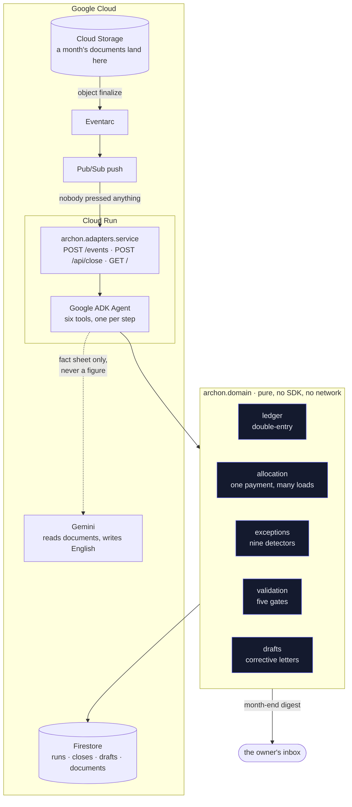
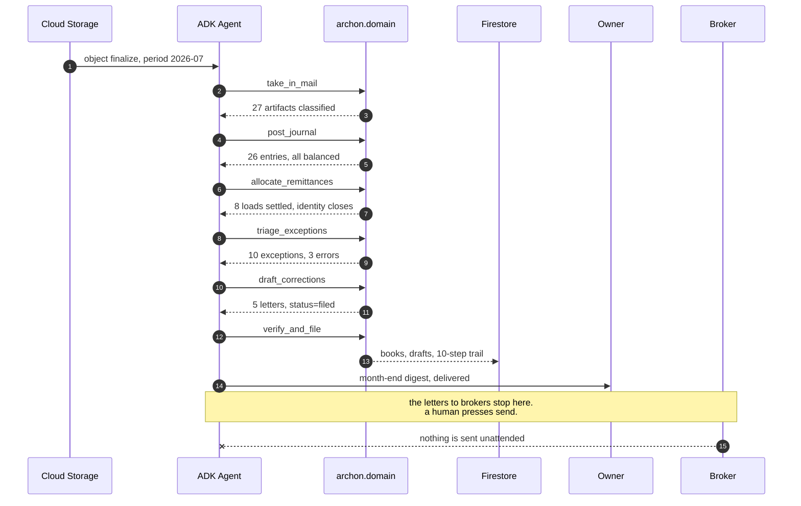

# Archon

[](https://github.com/upgradedev/archon-gcp-agentic/actions/workflows/ci.yml)
[](https://github.com/upgradedev/archon-gcp-agentic/actions/workflows/readiness.yml)
[](LICENSE)

*The readiness badge is red on purpose and will stay red until the demo URL
below is real. It is a submission gate, not a build gate: it fetches the live
judge URL and refuses to pass while that URL is a placeholder. The CI badge
covers the secret scan, the build and the tests.*

> **Archon is a bookkeeping agent for owner-operator trucking firms that splits one broker payment back across the eight loads it settles and files the letters chasing what was underpaid, so the owner wakes up to a closed month in their inbox instead of a shoebox they will get to in April.**

Built for [All Things Agentic](https://allthingsagentichackathon.devpost.com/), track **The Taskmaster**.

- **Live demo**: [https://archon-70489367760.us-central1.run.app/](https://archon-70489367760.us-central1.run.app/). No account, no install, one button.
- **Demo video**: not yet recorded.
- **Who it is for**: owner-operator trucking firms running three to twelve trucks.

---

## Contents

- [The submission description](#the-submission-description)
- [The chore](#the-chore)
- [Why a haulier's month is hard](#why-a-hauliers-month-is-hard)
- [Spin it up](#spin-it-up)
- [What one run does](#what-one-run-does)
- [Architecture](#architecture)
- [Architecture review, and the gaps left in it](#architecture-review-and-the-gaps-left-in-it)
- [Where the autonomy stops, and why there](#where-the-autonomy-stops-and-why-there)
- [What Google is doing here](#what-google-is-doing-here)
- [The books are computed, never phrased](#the-books-are-computed-never-phrased)
- [Tests and evidence](#tests-and-evidence)
- [The trigger, fired on the live deployment](#the-trigger-fired-on-the-live-deployment)
- [Deploy it](#deploy-it)
- [Pre-existing components](#pre-existing-components)
- [Honest scope](#honest-scope)
- [Licence](#licence)

---

## The submission description

*This is the text for the entry form, kept here so it is reviewable and so it
cannot drift from the product. Owner's voice, no em dashes.*

---

Archon closes a small trucking firm's month while nobody is watching, and the
thing that makes that possible is that it can split one broker payment back
across the eight separate loads it settles.

That sounds small. It is the reason a haulier's books never close. A broker does
not pay per load. It pays once a fortnight, in a single bank credit, covering
however many loads it feels like, minus a factoring fee charged on the whole
batch, minus whatever it decided to hold back on individual loads. The bank shows
one number and the books need nine. Matching software cannot do it, because
matching asks "which document is this payment" and the honest answer is "eight of
them, at amounts none of which equal the payment."

So Archon allocates instead, and then proves its own answer. What landed in the
bank has to equal what the lines pay, less the fee charged once. When that leaves
anything over, it says so rather than pushing it into a suspense account.

A month of documents lands in a Cloud Storage bucket. Nothing is pressed. Eventarc
wakes a Cloud Run container, and a Google ADK agent works through ten steps: it
classifies 27 artifacts, posts the double-entry journal, splits the remittance,
reconciles which loads were paid, finds the nine things that do not add up, writes
the corrective letters, checks its own books against five gates, and marks the
period closed with a trail in Firestore you can walk back through.

Then it emails the owner. That last step matters more than it looks. A haulier
does not open a bookkeeping console on the first of the month, because a haulier
is driving. If the answer only exists on a page we built, the agent worked all
night for nobody. So the month arrives where they already read their mail: what
the firm made, what is still recoverable and from whom, and what Archon already
did about it.

On the July it ships with, that is 23,005.00 billed over 10,810 miles against
21,010.76 spent. A margin of 0.184 a mile. And 5,512.85 sitting in five letters
it wrote: a broker that quietly paid 200.00 light on one load, a truck stop that
charged the same 412.85 twice in three days, two loads no remittance ever touched,
and 1,865.00 that left the account with no invoice behind it. On that margin, the
5,512.85 matters more than the profit does.

The letters to brokers and suppliers are written, costed and filed unsent. That is
the one thing a person does, and it is deliberate: every step Archon takes can be
re-run and produces the same books, but an email to a broker cannot be un-sent.

Every figure above was computed by a deterministic ledger, never phrased by a
model. Gemini reads documents and writes English; it is handed a fact sheet and is
never in a position to introduce a number. An artifact nobody could read is
reported as an exception and posted as nothing, and a gate fails the whole close if
an unreadable document is ever given a figure, because that is the one failure that
would not announce itself.

Built on Google ADK, Gemini, Cloud Run, Firestore, Cloud Storage and Pub/Sub. Take
ADK away and there is no agent, only a function somebody has to remember to run.
Take Firestore away and a container that scales to zero between months has nowhere
to keep the trail.

It is for owner-operator trucking firms running three to twelve trucks. It replaces
the shoebox, and the bookkeeper who gets to it in April.

---

## The chore

A month of mail lands in a bucket. Nobody is watching. Archon then:

1. takes in 27 artifacts and classifies each one
2. posts the double-entry journal
3. **splits one broker remittance across the eight loads it settles, net of the factoring fee**
4. reconciles which loads got paid and which did not
5. triages what is missing or contradictory, worst first
6. **decides what to do about each one**: chase it, put it in front of the owner,
   or note it. This is the agent's own judgement, and every choice is checked
   against the books before it can take effect
7. writes the corrective letters and files them
8. checks its own work against five gates
9. writes the month-end summary from a fact sheet it is not allowed to add to
10. marks the period closed with a trail you can walk back through
11. **emails the owner their month-end letter**, because a haulier does not open a
    bookkeeping console on the first of the month, they are driving

Nobody is asked anything at any point. The one thing a person does is press send
on the letters that leave for a third party.

**The trigger**: an object landing in the Cloud Storage bucket, via Eventarc.
Nobody presses anything.
**The surface**: the owner's own inbox, which they already open.
**What it replaces**: the shoebox, and the bookkeeper who reconciles it in April.

## Why a haulier's month is hard

A broker does not pay per load. It pays once a fortnight, in a single bank
credit, covering however many loads it feels like, minus a factoring fee charged
on the whole batch, minus whatever it decided to hold back on individual loads.

The bank shows one number. The books need nine.

Matching software cannot do this. Matching asks "which document is this
payment?" and the answer is "eight of them, at amounts none of which equal the
payment." Archon allocates instead, and then proves its own answer against an
identity that has to close:

```
what landed in the bank  ==  what the lines pay  -  the fee charged once
```

When that identity leaves a residual, the close raises it. It does not absorb it
into a suspense account, because a suspense account is where a bookkeeper hides
the thing they could not explain, and hiding it is exactly what the owner is
paying for this not to do.

## Spin it up

**The whole close, with nothing installed.** No key, no credential, no network,
no dependency beyond the Python standard library:

```bash
git clone https://github.com/upgradedev/archon-gcp-agentic.git
cd archon-gcp-agentic
python run.py
```

That prints the eleven-step trail, the month, the exceptions and the filed
letters. CI runs that exact command inside an empty virtualenv on every push, and the
readiness gate runs it too, so if it ever stops working the build goes red
rather than a judge finding out.

`run.py` is three lines: the package lives under `src/`, and asking a judge to
`pip install -e .` before seeing anything would make the claim above false.

**The page and the API:**

```bash
pip install -r requirements.txt
uvicorn archon.service:app --reload
```

Then open `http://localhost:8000`, press one button, and watch it run.

**Let the ADK agent drive it** (needs a Gemini key):

```bash
export GOOGLE_API_KEY=...
python run.py --agent
```

**Run the tests:**

```bash
pip install -r requirements-dev.txt
python -m pytest
```

## What one run does

Over the bundled month, `python run.py`:

```
 + 1. Take in the month's mail
     27 artifacts: bank transaction x6, broker remittance x1, driver settlement x3,
     fuel card statement x1, insurance invoice x1, load confirmation x9,
     maintenance invoice x2, toll invoice x3, unreadable x1
 + 2. Post the double-entry journal
     26 entries posted from 27 artifacts, 1 deliberately left unposted
 + 3. Split each remittance across the loads it settles
     1 remittance(s) split across 8 loads; every one reconciles
 + 4. Reconcile loads against what the brokers paid
     8 of 9 loads settled, 2 still outstanding
 + 5. Find what is missing or does not add up
     10 exception(s), 3 of them errors, 2,477.85 at stake
 + 6. Write the corrective documents
     5 document(s) drafted and filed unsent, chasing 5,512.85
 + 7. Check the close against its own gates
     5/5 gates passed
 + 8. Write the month-end summary
     summary written from a 60-line fact sheet; no figure was phrased by a model
 + 9. File the close and mark the period
     period 2026-07 marked closed
 + 10. Write the owner their month-end letter
     "2026-07 closed. 5,512.85 is recoverable, 5 letters ready" -> composed for
     owner@bellridgehaulage.example and filed; no channel is configured, so
     nothing left this machine
 = closed
```

The month it found: 23,005.00 billed over 10,810 miles, 21,010.76 spent,
1,994.24 of profit. That is 2.128 a mile earned against 1.944 a mile spent, and
the 0.184 a mile left over is why the 5,512.85 sitting in those five letters
matters more than the profit does.

### The nine things it looks for

Every one has a deterministic detector, and every one fires on the bundled
month, asserted by a test:

| What | Example from the bundled month |
|---|---|
| Payment with no document | 1,865.00 left the account referencing INV-2291 with no invoice on file |
| Silent short pay | Load L-7105 invoiced at 2,460.00, remittance paid 2,260.00, no reason given |
| Duplicate charge | The same 412.85 fill at the same truck stop three days apart |
| Amount outlier | A 1,890.00 fill, 4.6x this firm's own median for that supplier |
| Tax inconsistency | An invoice at 20% when this firm's own prevailing rate is 8% |
| Unpaid load | Two loads run and invoiced that no remittance has touched |
| Unreconciled remittance | A remittance paying a load with no confirmation on file |
| Out of period | A June toll invoice arriving in July's mail |
| Unreadable document | A cab-phone scan with no text layer, left unposted rather than estimated |

Every threshold is learned from the firm's own books. A charge is an outlier
because it is far above what **this** firm normally pays **that** supplier, not
because it crossed a figure somebody wrote down. That is what lets Archon work
on a firm's first month, before anyone has configured it.

## Architecture

Two diagrams. The first is what runs where. The second is the one that matters:
what the agent does between a file landing and the owner reading about it.



The agent flow, from a file landing to the owner reading about it, and where
the two outward edges sit:



The deterministic engine is standard library only. ADK, Firestore and FastAPI
sit on top of it and are imported lazily, which is why the close runs on a clean
checkout and why the whole test suite runs offline.

## Architecture review, and the gaps left in it

Three frameworks apply to this build. Each table's last column is the residual
gap, and it is never empty: a review with nothing left over is a review that was
not done.

### Google Cloud Architecture Framework, plus the agentic lens

| Pillar | What this build does | Residual gap |
|---|---|---|
| Operational excellence | Every run writes an eleven-step journal to Firestore with counts per step, so an unattended close can be retraced. `POST /api/close/{period}` re-runs it deterministically | No alerting and no SLO. Nobody is paged if a month fails to close |
| Security | The domain layer holds no credential and reaches no network. Secrets come from environment only, and the SMTP password never reaches a receipt or a stored document, asserted by a test | `POST /events` is unauthenticated so the demo needs no account. A forged Pub/Sub envelope can trigger a close |
| Reliability | A model outage, a mail server outage or a deliverer raising cannot fail a close: each is caught and the deterministic path continues. Five gates block a close that cannot verify its own books | Single region, no retry budget, no dead-letter topic on the push subscription |
| Cost optimisation | Firestore and Cloud Run both cost nothing when idle, which is the shape of a business that closes its books twelve times a year | No budget alert configured |
| Performance efficiency | The close is 27 artifacts and finishes in about 15 ms locally, because the engine is pure Python over in-memory structures | Never load tested. A firm with 40 trucks and 400 fuel lines is untested |
| Sustainability | Scale to zero between months; no idle compute | Not measured |
| **Agentic lens: bounded autonomy** | Two edges with different rules. The agent acts freely on state it owns and stops at a third party's inbox. Enforced by there being no send path to a counterparty, asserted by two tests | The boundary is enforced by absence, not by a policy engine. Adding a send path is a code review away |
| **Agentic lens: grounding** | The model is handed a fact sheet of computed figures as text. It never sees a document and cannot introduce a number. The agent path and the deterministic path are asserted byte-identical | No automated check that the model's prose agrees with the fact sheet; the deterministic summary is the reference, not a judge |

### EU AI Act (Regulation (EU) 2024/1689)

This is a narrow, non-high-risk system: it does bookkeeping for one firm and
takes no decision about a person. The articles below are the ones that bear on
it anyway, and the row is what we actually do, not what we intend.

| Article | What it requires | What this build does | Residual gap |
|---|---|---|---|
| Art. 10, data governance | Training and input data are relevant, representative and examined for bias | No model is trained here. Input is the firm's own documents, and the anomaly thresholds are learned from that firm's own books rather than from an external norm, so no population assumption is imported | The bundled corpus is synthetic and single-firm. No evaluation of extraction accuracy across document families exists in this repository |
| Art. 13, transparency | The deployer can interpret the output and use it appropriately | Every figure traces to a source document through `source_file`, the run journal names what each step touched, and the fact sheet the summary is written from is served at `/api/close/{period}` | No per-figure provenance in the interface itself; the trace is available but the page does not surface it per cell |
| Art. 14, human oversight | A human can oversee, intervene and stop | The one irreversible action, contacting a counterparty, requires a person. Corrective letters are filed with `status="filed"` and no send path exists | Oversight is all-or-nothing at that edge. There is no partial approval, no audit of who approved what, and no way to stop a close mid-run |
| Art. 15, accuracy and resilience | Accuracy, resilience to error, and cybersecurity appropriate to purpose | Arithmetic is deterministic and unit tested; five gates fail the close rather than publish books that do not verify; an unreadable document is refused rather than estimated, enforced by gate G5 | No measured extraction accuracy against a labelled corpus. Resilience is asserted for the paths tested, not characterised |
| Art. 50, disclosure | People are told they are interacting with an AI system | The page, the README and the digest all say an agent did the work. The digest is signed by the firm and describes itself as written by Archon | The drafted letters to counterparties do not disclose that an AI drafted them. That is a real gap, and it lands on a third party |

Nothing here claims the system meets the Act. These are the controls that exist,
and the ones that do not.

### GDPR

| Question | Answer |
|---|---|
| What personal data is processed? | In the shipped repository, none. Bell Ridge Haulage, its brokers, its suppliers and its three drivers are invented. The drivers are named "Driver 1" through "Driver 3" precisely so that no synthetic name reads as a real one |
| Prove it | `grep -rniE "[a-z0-9._%+-]+@[a-z0-9.-]+\.[a-z]{2,}" corpus/` returns nothing. The only address in the product is the configurable `ARCHON_OWNER_EMAIL`, which defaults to an `example` domain |
| What would be processed in production? | A firm's own commercial documents, and driver settlement data, which is personal data about employees |
| Where would it live | Firestore and Cloud Storage in the deploying firm's own project. No data leaves that project except the document text sent to Gemini for extraction, and the fact sheet sent for phrasing |
| For how long | Not implemented. There is no retention policy and no deletion path in this repository, and a production deployment would need both |

### What it costs when nobody is using it

| Service | Idle cost | Measured from |
|---|---|---|
| Firestore, Native mode | **0.00**, within the free tier of 50,000 reads, 20,000 writes and 20,000 deletes a day and 1 GiB stored | cloud.google.com/firestore/pricing, us-central1, read 2026-08-19 |
| Cloud Run, min-instances 0 | **0.00** when no request is in flight | cloud.google.com/run/pricing, read 2026-08-19 |
| Cloud Storage, one month of documents | under 0.01 at this volume | cloud.google.com/storage/pricing, read 2026-08-19 |

A haulier closes their books twelve times a year, so idle cost is the number
that decides whether this is affordable. Cloud SQL was rejected for exactly this
reason: the smallest sensible instance bills by the hour whether a truck moved
or not.

## Where the autonomy stops, and why there

There are two outward edges and they have different rules. That asymmetry is the
architecture, not a compromise in it.

**Towards a third party, the close stops.** The letters it writes to brokers and
suppliers are filed with `status="filed"`, and there is no send path to a
counterparty in this repository. A test asserts that, and a second test asserts
that no function in the drafts module has "send" in its name, so adding one is a
decision somebody has to make on purpose.

That line is not squeamishness about autonomy. It is where reversibility runs
out. Every step of the close can be re-run and produces the same books, because
the engine is deterministic and the run is keyed by the period and its
documents. An email to a broker cannot be un-sent.

**Towards the owner, the close does not stop.** Step 10 writes them a letter and
delivers it. That is their own books arriving at them, and holding it back until
they remember to open a console we built is how an unattended agent becomes a tab
nobody clicks. `archon/delivery.py` carries both a real SMTP deliverer on the
standard library and a filing one that composes and sends nothing; the filing one
is the default, which is why the demo and CI need no credential and why a judge
sees the exact bytes that would arrive without anything leaving the machine.

A test closes the month with a live SMTP transport injected and asserts, in the
same run, that the owner received their letter and that every counterparty draft
is still unsent. If either half of that ever drifts, it goes red.

## What Google is doing here

**Remove Google ADK and there is no agent.** The six tools in `archon/agents.py`
are the close, one step each, and it is the ADK `Agent` that decides to call
them and when the month is finished. Take it away and what is left is a function
somebody has to remember to run, on a schedule somebody has to maintain, with a
summary nobody wrote. The unattended part of the claim lives in that file.

**Remove Firestore and the run has no memory.** A Cloud Run container that
scales to zero between months has nowhere to keep the trail, the books or the
filed letters, and the owner who looks on Monday has nothing to look at.

| Concern | Google service | Where | Fallback |
|---|---|---|---|
| Agent framework | **Google ADK** `Agent` | `archon/agents.py` | none: no agent without it |
| Multi-agent reporting | **ADK `SequentialAgent`** | `archon/agents.py` | deterministic narrator |
| Model | **Gemini** | extraction and reporting | deterministic parser and narrator |
| Memory | **Firestore** | `archon/store.py` | in-memory, for the demo and tests |
| Serving | **Cloud Run** | `Dockerfile`, `scripts/deploy.sh` | local uvicorn |
| Trigger | **Pub/Sub + Eventarc** | `POST /events` | the button on the page |
| Reaching the owner | SMTP, standard library | `archon/delivery.py` | compose and file, sending nothing |

Firestore rather than a managed SQL instance, on purpose: what Archon persists
is a document with a nested trail, written from a stateless container that is
idle most of the month. Firestore costs nothing when idle. A haulier closes
their books twelve times a year.

**A note on `SequentialAgent`.** ADK deprecates it in favour of a graph-based
`Workflow` whose LlmAgent adapter is still private
(`google.adk.workflow._llm_agent_wrapper`). This repository stays on
`SequentialAgent` and pins `google-adk>=2.3,<3` rather than write against an API
whose public shape cannot be confirmed from the installed package. The offline
agent tests pass on both versions this has been run against, 2.3.0 locally and
2.7.1 in CI, so the choice is checked rather than assumed. The deprecation
warning is left visible rather than filtered: a hidden deprecation is how this
becomes an emergency.

## The books are computed, never phrased

The rule the whole product rests on: **the agent orchestrates, the ledger
computes.**

- Every figure the owner sees was produced by `ledger.py`, `allocation.py` or
  `exceptions.py`, all of which are pure and have no model call in them.
- The model is handed a fact sheet of already-computed figures as text. It is
  never handed the documents and never asked for a total.
- The agent's tools return counts and summaries. There is no path from the
  agent to a number in the books, and a test asserts that the agent path and the
  deterministic path produce byte-identical output.
- An artifact nobody could read is reported as an exception and posted as
  nothing. A gate fails the whole close if an unreadable document is ever given
  a figure, because that is the one failure that would not announce itself: an
  estimated invoice balances, rolls up and reads perfectly, and is simply untrue.

## Tests and evidence

Every number below carries the command that produced it. Take the current
figures from CI, not from here.

| Claim | Value | Command |
|---|---|---|
| Tests, all offline | 372 | `python -m pytest` |
| Lint | clean | `python -m ruff check .` |
| Gates proven to fail | 5 of 5 | `python -m pytest tests/unit/test_validation.py -k fail` |
| Detectors firing on the bundled month | 9 of 9 kinds | `python -m pytest -k test_every_detector_fires_on_the_bundled_month` |

The suite is a pyramid and it is entirely offline: no key, no credential, no
paid call.

- **unit** covers each posting shape, the allocation identity, all nine
  detectors both firing and staying quiet, all five gates both passing and
  failing, the drafts, the run journal and the store.
- **integration** runs the real ADK `Agent` against a scripted model, so genuine
  function calling is exercised, and the real `SequentialAgent`, so genuine
  state hand-off between stages is exercised. Only the weights are fake.
- **e2e** runs the CLI and drives the FastAPI service, including a Pub/Sub push
  envelope closing the month with nobody present.

Three properties are asserted rather than assumed, because they are the product:
that no counterparty draft is ever sent, that the owner's letter is delivered in
the same run, and that the agent path and the deterministic path agree exactly.

Each of the five gates is broken on purpose, once, and asserted red. A gate
nobody has watched fail is a gate nobody should believe.

## The trigger, fired on the live deployment

Not a diagram. This happened, on the URL above, and it is the part of the claim
that is hardest to believe without seeing it.

```bash
gcloud storage cp corpus/2026-07/remittance-MFX-RA-4417.txt \
    gs://upgradegr-archon-agentic-archon-mail/mail/2026-07/
```

An object landed in a bucket. Cloud Storage published an object-finalize
notification, Pub/Sub pushed it to `/events` with an OIDC token, and Cloud Run
closed the month. Nobody pressed anything, and nobody was watching.

Three requests hit that one route, and together they are the whole argument:

```
12:38:27Z   POST /events  ->  200    a document landed, the month closed
12:40:46Z   POST /events  ->  403    an anonymous curl, refused
12:42:58Z   POST /events  ->  200    a second document, caller now pinned
```

Read from the deployment itself:

```bash
gcloud logging read 'resource.type=cloud_run_revision
  AND resource.labels.service_name=archon
  AND httpRequest.requestUrl:"/events"' --format="value(httpRequest.status,timestamp)"
```

That contrast is the least-privilege boundary, on live infrastructure rather
than in a test. The button on the page exists for the same reason the video
does: a file arriving is not watchable, so a judge gets a way to see the same
work happen on demand.

## Deploy it

```bash
PROJECT_ID=your-project ./scripts/deploy.sh
```

That builds the image, deploys to Cloud Run, creates the Firestore database, the
mail bucket, the Pub/Sub topic and the push subscription. Then, to watch it fire
with nobody touching it:

```bash
gcloud storage cp corpus/2026-07/remittance-MFX-RA-4417.txt gs://your-project-archon-mail/mail/2026-07/
```

## Pre-existing components

This project was created new for this hackathon. Two things were carried across
from the owner's earlier work, and both are named here because both rulebooks
require the disclosure.

| Carried across | From | What changed |
|---|---|---|
| `tests/adk_fakes.py` | an earlier Archon GCP build by the same author | unchanged in substance; re-headed |
| The Firestore-or-local store seam in `archon/store.py` | the same build | widened from one collection to four |
| The shape of the offline-first agent layer, and the injectable-model pattern | the same build | rewritten for this domain |

Everything else in this repository was written for this entry: the trucking
domain model, the ledger, the allocation engine, all nine detectors, the five
gates, the drafts, the run journal, the close orchestrator, the service, the
page, the corpus and the tests.

The owner also maintains a commercial financial back-office product. Its
interface patterns and its idea of surfacing what is missing rather than only
what is present informed this build. **No code, no data, no customer
information and no configuration from that product is in this repository**, and
its persistence model is deliberately not used here.

## Honest scope

- **Bell Ridge Haulage is synthetic.** The firm, the brokers, the suppliers and
  every figure are invented. The month was written to contain one instance of
  each defect the detectors look for, so that a run demonstrates each one on
  something real rather than on a fixture that agrees with it.
- **The deterministic extractor is the reference path**, and it is what the demo
  and CI use. It parses the label blocks OCR leaves behind. The Gemini vision
  path in `archon/agents.py` is what handles a photograph of a fax, and it is
  not exercised in CI, because CI has no key.
- **The digest is composed but not delivered in the demo**, because no mail
  server is configured and configuring one would put a credential in a public
  repository. `SmtpDelivery` is real, runs on the standard library, and is
  exercised in tests against an injected transport. Set `ARCHON_SMTP_HOST` and
  it sends.
- **One period, one company.** There is no multi-tenancy, no authentication and
  no billing here. Those exist in commercial products and would be noise in a
  submission about whether an agent can finish a chore.
- **`POST /events` is closed on the deployment.** The page is open to anyone
  with no account, and the trigger is not: it verifies a Google-signed OIDC
  token for this service's own audience, minted by one named service account
  and nobody else. An anonymous call gets `403 {"reason":"no bearer token"}`.
  You can check both from a terminal, and the two are on the same route.
- **The live demo is deployed** at [https://archon-70489367760.us-central1.run.app/](https://archon-70489367760.us-central1.run.app/), on Cloud Run backed by
  Firestore, and `/api/health` reports which store it is using so you can check
  rather than take our word for it. `POST /events` on that deployment is closed:
  it answers 403 to an unauthenticated trigger while the page stays open to
  anyone.

## Licence

MIT. See [LICENSE](LICENSE).
